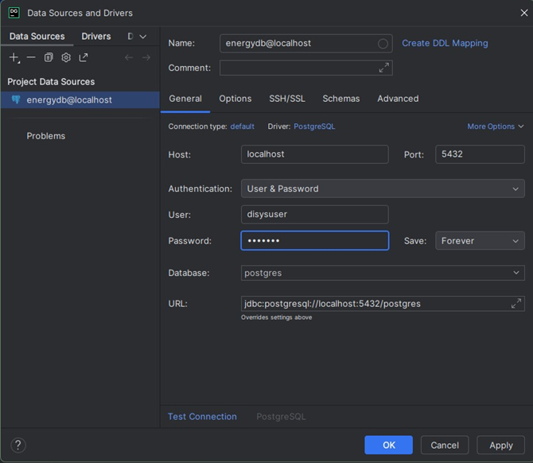
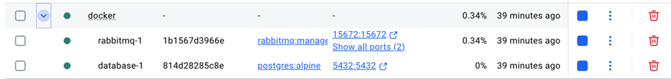
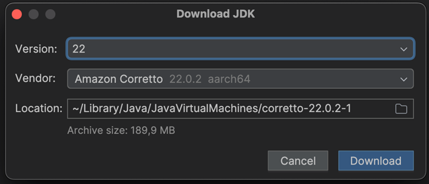

# disys-project

Folgender Link ist für das Repository und kann für das Klonen verwendet werden:
git clone https://github.com/tolstoiOM/disys-project

Danach muss noch der Docker Container erstellt werden, dazu in den docker Ordner aus dem Projekt navigieren und folgenden Befehl ausführen:
docker-compose up –build

Dann sollte der Container erstellt werden.
WICHTIG: Docker Desktop muss installiert sein

Die Tables werden automatisch beim docker compose erstellt, sollte es hier zu Problemen kommen kann es alternativ mit diesen Queries erstellt werden:

CREATE TABLE UsageService ( hour TIMESTAMP PRIMARY KEY, community_produced DECIMAL(10, 2) NOT NULL DEFAULT 0, community_used DECIMAL(10, 2) NOT NULL DEFAULT 0, grid_used DECIMAL(10, 2) NOT NULL DEFAULT 0 ); 

CREATE TABLE CurrentPercentageService ( hour TIMESTAMP PRIMARY KEY, community_depleted DECIMAL(10, 2) NOT NULL DEFAULT 0, grid_portion DECIMAL(10, 2) NOT NULL DEFAULT 0 );

In DataGrip kann man sich die Datenbank anschauen, hierzu benötigt man folgende Einstellungen:
 

Dann noch kontrollieren ob der Container läuft:
 

Wenn das erledigt ist, ist es noch wichtig für das folgende Projekt  message_service unter disys-project/message_service die JDK Version 22 zu verwenden. 
Die Version welche wir verwendet haben ist die folgende:

 

Nun sollten alle Prerequisites erfüllt sein und das Projekt kann gestartet werden.

Damit das Projekt ordnungsgemäß läuft sollte man die Services wie folgt starten:
1.	Message_services: Diese können alle direkt über die Main gestartet werden
2.	REST API: Diese kann über das File Disys4SecondApplication.java gestartet werden
3.	Das Interface: Dieses kann auch über die Main gestartet werden

Das Projekt sollte nun laufen und funktionieren.

Link zum Repository: https://github.com/tolstoiOM/disys-project
